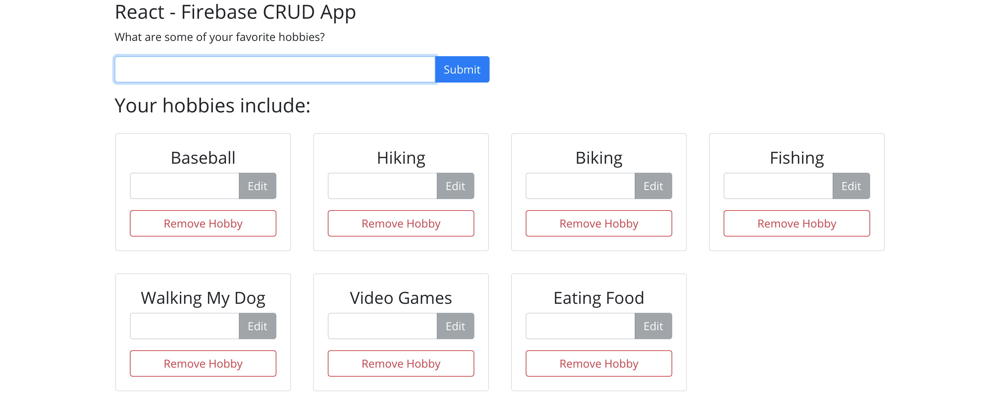

## React/Firebase CRUD App

I created this app to practice implementing Firebase within a React project. This is a simple list that you can create, edit, and remove items using Firebase's Realtime Database.

This project was styled using [Reactstrap](https://reactstrap.github.io/).
